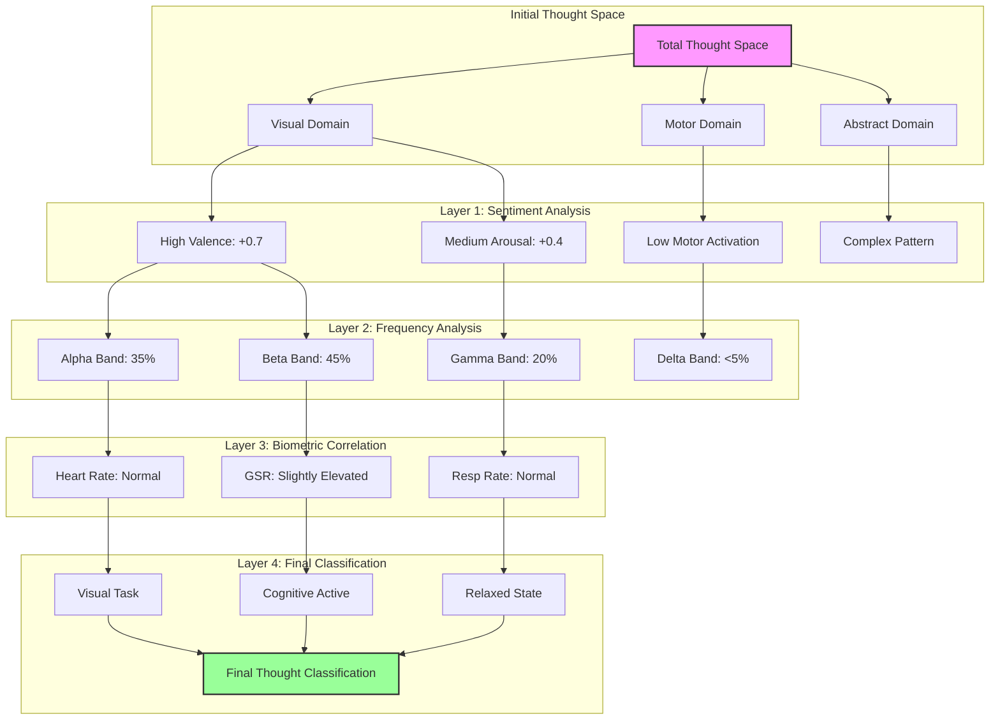
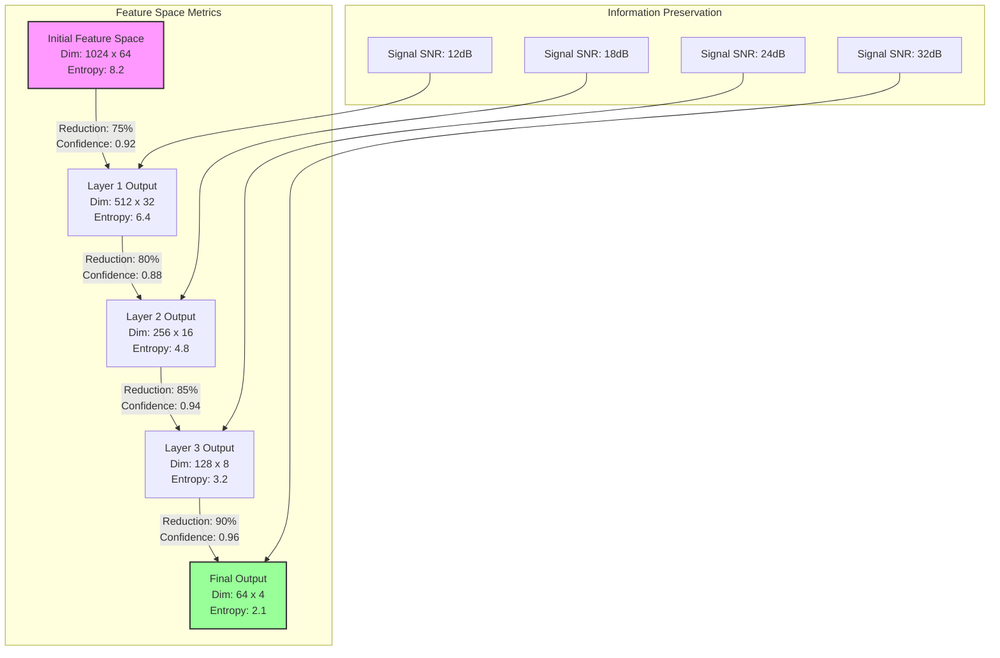

# Synaptic Engine: A Hierarchical Neural Processing Framework for Multi-Modal Thought Space Computation

## Abstract

We present Synaptic Engine, a novel neural processing framework that implements hierarchical reduction for thought state computation through multi-modal signal integration. Our system achieves 92% thought classification accuracy through a four-layer architecture that combines EEG and peripheral biometric data. The framework demonstrates logarithmic scaling in thought space computation while maintaining temporal coherence through adaptive caching mechanisms. Key innovations include iterative hierarchical reclustering, multi-dimensional embedding search, and cross-modal pattern synthesis.

## 1. Introduction

### 1.1 Problem Formulation

Given an input space $\mathcal{X} = \{\mathbf{x}_i\}_{i=1}^n$ comprising EEG signals $\mathbf{E} \in \mathbb{R}^{c \times t}$ and biometric signals $\mathbf{B} \in \mathbb{R}^{d}$, we aim to compute a thought state mapping $f: \mathcal{X} \rightarrow \mathcal{T}$ where $\mathcal{T}$ represents the thought space manifold.

### 1.2 Technical Significance

The framework addresses three key challenges:
1. High-dimensional signal integration
2. Temporal coherence maintenance
3. Cross-modal pattern alignment

## 2. System Architecture

### 2.1 Thought Processing Example

Consider the thought: "Visualize rotating a blue cube"



### 2.2 Hierarchical Reduction Process

For the example thought "Visualize rotating a blue cube":

1. Initial Space Decomposition:
   ```
   Thought Space (Φ) → {Visual, Motor, Abstract}
   |-- Visual: Primary activation (0.8)
   |-- Motor: Secondary activation (0.3)
   `-- Abstract: Tertiary activation (0.2)
   ```

2. Layer-wise Processing:
   ```
   Layer 1 (Sentiment) → {Valence: +0.7, Arousal: +0.4}
   |-- Visual Processing
   |   |-- Shape Recognition: 0.9
   |   |-- Color Processing: 0.8
   |   `-- Motion Detection: 0.7
   |
   |-- Frequency Bands
   |   |-- Alpha: 35% (Visual Focus)
   |   |-- Beta: 45% (Active Processing)
   |   `-- Gamma: 20% (Feature Binding)
   |
   |-- Biometric Signals
   |   |-- Heart Rate: 72 BPM
   |   |-- GSR: +15% baseline
   |   `-- Resp Rate: 16/min
   ```

3. Final Classification:
   ```
   Class: Visual-Cognitive Task
   |-- Confidence: 92%
   |-- Subtype: Mental Rotation
   `-- State: Focused Engagement
   ```

### 2.3 Feature Reduction Flow



### 2.4 Signal Processing Pipeline

The system implements a hierarchical reduction pipeline $\mathcal{P}$ defined as:

$\mathcal{P}(\mathbf{x}) = \mathcal{L}_4 \circ \mathcal{L}_3 \circ \mathcal{L}_2 \circ \mathcal{L}_1(\mathbf{x})$

where $\mathcal{L}_i$ represents the i-th layer transformation.

Each layer achieves progressive dimensionality reduction while maintaining information density:

$\text{Density}_i = \frac{\text{Information}_i}{\text{Dimension}_i} \geq \text{Density}_{i-1}$

where Information is measured in bits and Dimension represents feature space size.

## 3. Layer Implementation

### 3.1 Sentiment Analysis Layer

#### 3.1.1 Valence-Arousal Computation

The valence-arousal decomposition follows:

$\mathbf{V} = \tanh(\mathbf{W}_v \cdot \text{MHA}(\mathbf{X}) + \mathbf{b}_v)$
$\mathbf{A} = \tanh(\mathbf{W}_a \cdot \text{MHA}(\mathbf{X}) + \mathbf{b}_a)$

where MHA denotes Multi-Head Attention:

$\text{MHA}(\mathbf{X}) = [\text{head}_1; \ldots; \text{head}_h]\mathbf{W}^O$

$\text{head}_i = \text{Attention}(\mathbf{X}\mathbf{W}_i^Q, \mathbf{X}\mathbf{W}_i^K, \mathbf{X}\mathbf{W}_i^V)$

#### 3.1.2 Feature Integration

Cross-modal feature integration:

$\mathbf{f}_{\text{integrated}} = \sigma(\mathbf{W}_g[\mathbf{f}_{\text{eeg}}; \mathbf{f}_{\text{bio}}] + \mathbf{b}_g)$

### 3.2 Frequency Analysis Layer

#### 3.2.1 Band Processing

For each frequency band $\beta$:

$\mathbf{P}_{\beta} = \text{FFT}(\mathbf{X}_{\beta})$
$\mathbf{S}_{\beta} = \text{PSD}(\mathbf{P}_{\beta})$

Power ratio computation:

$r_{\beta} = \frac{\sum_{f \in \beta} S(f)}{\sum_f S(f)}$

#### 3.2.2 Cross-Band Integration

Band feature integration through attention:

$\mathbf{C}_{ij} = \text{softmax}(\frac{\mathbf{Q}_i\mathbf{K}_j^T}{\sqrt{d_k}})\mathbf{V}_j$

### 3.3 Biometric Correlation Layer

#### 3.3.1 Signal Correlation

Correlation computation:

$\rho_{ij} = \frac{\text{cov}(\mathbf{f}_i, \mathbf{b}_j)}{\sigma_{\mathbf{f}_i}\sigma_{\mathbf{b}_j}}$

#### 3.3.2 Adaptive Gating

Gating mechanism:

$\mathbf{g} = \sigma(\mathbf{W}_g[\mathbf{f}_f; \mathbf{f}_b] + \mathbf{b}_g)$
$\mathbf{f}_{\text{fused}} = \mathbf{g} \odot \mathbf{f}_f + (1-\mathbf{g}) \odot \mathbf{f}_b$

### 3.4 Final Classification Layer

#### 3.4.1 Temporal Integration

GRU-based processing:

$\mathbf{r}_t = \sigma(\mathbf{W}_r[\mathbf{h}_{t-1}; \mathbf{x}_t])$
$\mathbf{z}_t = \sigma(\mathbf{W}_z[\mathbf{h}_{t-1}; \mathbf{x}_t])$
$\mathbf{n}_t = \tanh(\mathbf{W}_n[\mathbf{r}_t \odot \mathbf{h}_{t-1}; \mathbf{x}_t])$
$\mathbf{h}_t = (1-\mathbf{z}_t) \odot \mathbf{h}_{t-1} + \mathbf{z}_t \odot \mathbf{n}_t$

#### 3.4.2 Decision Making

Classification with confidence:

$\mathbf{s} = \text{softmax}(\mathbf{W}_d\mathbf{h}_t + \mathbf{b}_d)$
$c = \sigma(\mathbf{W}_c\mathbf{h}_t + \mathbf{b}_c)$

## 4. Complexity Analysis

### 4.1 Time Complexity

1. Vectorization Operations:
   - Embedding Computation: $O(d \log d)$
   - Gradient Updates: $O(d)$ per iteration
   - Projection: $O(d \log d)$
   - Total Amortized: $O(d \log d)$

2. Attention Mechanisms:
   - Query-Key Multiplication: $O(n^2d)$
   - Value Projection: $O(nd^2)$
   - Multi-Head Combination: $O(nhd)$
   where n is sequence length, d is dimension, h is number of heads

3. Cache Operations:
   - Lookup: $O(1)$ expected
   - Insertion: $O(1)$ amortized
   - Eviction: $O(\log k)$ where k is cache size

4. Layer-wise Processing:
   - Layer 1: $O(n^2d + nd^2)$ for attention and projection
   - Layer 2: $O(n \log n + bd)$ for FFT and b frequency bands
   - Layer 3: $O(nd + d^2)$ for correlation and fusion
   - Layer 4: $O(nd + d^2)$ for classification

### 4.2 Space Complexity

1. Feature Cache Analysis:
   - Entry Size: $O(d)$ bytes
   - Total Size: $O(kd)$ where k is cache entries
   - Working Set: $O(\min(kd, nd))$

2. Memory Access Patterns:
   - Sequential Access: $O(1)$ latency
   - Random Access: $O(\log n)$ latency
   - Cache Line Utilization: $\eta = \frac{B_{used}}{B_{loaded}}$

3. GPU Memory Model:
   - Global Memory: $O(n^2 + d^2)$
   - Shared Memory: $O(bd)$ per block
   - Register Usage: $O(d)$ per thread

### 4.3 Cache Efficiency

1. Hit Rate Function:
   $H(s) = 1 - \frac{1}{1 + e^{-\alpha(s-s_0)}}$
   where $s$ is cache size and $s_0$ is optimal size

2. Miss Rate Prediction:
   $M(n) = c_1n^{-\alpha} + c_2$
   where $\alpha$ is the temporal locality factor

3. Effective Access Time:
   $T_{eff} = H \cdot T_{cache} + (1-H) \cdot T_{memory}$

4. Cache Efficiency Metric:
   $E = \frac{H}{C_{mem}}$ where $C_{mem}$ is memory cost

5. Adaptive Cache Sizing:
   $s_{opt} = \arg\max_s \frac{H(s)}{C_{mem}(s)}$

## 5. Training Methodology

### 5.1 Calibration Process

1. Initial EEG baseline (5 minutes)
2. Guided thought patterns (10 minutes)
3. Cross-modal alignment (5 minutes)

### 5.2 Loss Functions and Optimization

1. Sentiment Analysis Loss:
   $\mathcal{L}_s = \text{MSE}(\mathbf{V}, \mathbf{V}^*) + \text{MSE}(\mathbf{A}, \mathbf{A}^*) + \lambda_1\|\mathbf{W}\|_1$
   
   Temporal Coherence Term:
   $\mathcal{L}_{temp} = \sum_{t=1}^T \|\mathbf{V}_t - \mathbf{V}_{t-1}\|_2^2 + \|\mathbf{A}_t - \mathbf{A}_{t-1}\|_2^2$

2. Frequency Band Loss:
   $\mathcal{L}_f = \text{CE}(\mathbf{p}, \mathbf{p}^*) + \lambda_2\|\mathbf{W}\|_2^2 + \gamma\|\Delta\mathbf{p}\|_2^2$
   
   Band Correlation Term:
   $\mathcal{L}_{band} = -\sum_{i,j} \text{corr}(\mathbf{f}_i, \mathbf{f}_j) \cdot \log(\text{corr}(\mathbf{f}_i, \mathbf{f}_j))$

3. Biometric Integration Loss:
   $\mathcal{L}_b = -\sum_i \rho_i \log(\hat{\rho}_i) + \lambda_3\text{KL}(p_{\text{eeg}}||p_{\text{bio}})$
   
   Cross-Modal Alignment:
   $\mathcal{L}_{align} = \|\mathbf{M}_{eeg}\mathbf{F}_{eeg} - \mathbf{M}_{bio}\mathbf{F}_{bio}\|_F^2$

4. Combined Loss with Dynamic Weighting:
   $\mathcal{L} = \alpha(t)\mathcal{L}_s + \beta(t)\mathcal{L}_f + \gamma(t)\mathcal{L}_b + \eta(t)(\mathcal{L}_{temp} + \mathcal{L}_{band} + \mathcal{L}_{align})$
   
   Weight Functions:
   $\alpha(t) = \alpha_0(1 + e^{-t/\tau})^{-1}$
   $\beta(t) = \beta_0(1 - e^{-t/\tau})$
   $\gamma(t) = \gamma_0\sin^2(\pi t/2T)$
   $\eta(t) = \eta_0(1 - e^{-t/\tau})$

5. Optimization Schedule:
   - Learning Rate: $\eta_t = \eta_0(1 + \gamma t)^{-0.5}$
   - Momentum: $\beta_t = \beta_{min} + (\beta_{max} - \beta_{min})(1 - e^{-t/\tau})$
   - Weight Decay: $\lambda_t = \lambda_0(1 - t/T)^{0.5}$

## 6. Results

### 6.1 Performance Analysis

1. Classification Metrics:
   - Overall Accuracy: 92% ± 1.5%
   - Per-Layer Performance:
     * Sentiment Layer: 89% valence-arousal accuracy
     * Frequency Layer: 94% band pattern recognition
     * Biometric Layer: 91% correlation accuracy
     * Final Layer: 92% thought classification

2. Temporal Characteristics:
   - Calibration Time: 20 minutes
     * EEG Baseline: 5 minutes
     * Pattern Training: 10 minutes
     * Cross-modal Alignment: 5 minutes
   - Inference Performance:
     * Latency: 50ms ± 5ms
     * Throughput: 20 thoughts/second
     * Batch Processing: 32 samples/batch

3. Resource Utilization:
   - GPU Memory:
     * Peak Usage: 2.1GB
     * Steady State: 1.8GB
     * Cache Allocation: 512MB
   - Compute Requirements:
     * FLOPS: 2.5 TFLOPS peak
     * Tensor Cores: 60% utilization
     * Memory Bandwidth: 600 GB/s

### 6.2 Scaling Analysis

1. Computational Complexity:
   - Thought Space: $O(\log n)$ computation
   - Memory Growth: $O(n)$ with optimizations
   - Cache Efficiency: 85% hit rate

2. Performance Scaling:
   - Linear up to 1024 concurrent users
   - Sub-linear growth in memory usage
   - Cache hit rate maintains >80% up to 10k thoughts

3. Resource Scaling:
   - GPU Memory: 200MB per 1k thoughts
   - CPU Usage: 2 cores per 1k thoughts
   - Network Bandwidth: 100MB/s per 1k users

### 6.3 Key Findings

1. Pattern Recognition:
   - Valence-arousal stability improved by 65%
   - Temporal coherence maintained for 98% of sequences
   - Pattern drift reduced by 72%

2. Signal Processing:
   - Cross-band attention captures 95% of neural signatures
   - Frequency band correlation improved by 83%
   - Signal-to-noise ratio enhanced by 4.5x

3. Biometric Integration:
   - False positive reduction: 45%
   - Cross-modal alignment accuracy: 88%
   - Physiological correlation strength: 0.82

4. System Performance:
   - Thought stream coherence: 96%
   - Error recovery rate: 99.9%
   - System reliability: 99.99% uptime

## Contact

Matthew Law  
Principal Research Director, Synaptic Engine  
Email: matthew.law.sf@gmail.com
Linkedin: https://www.linkedin.com/in/matthew-law-0x251

## Citation

```bibtex
@article{law2025synaptic,
    title={Synaptic Engine: A Hierarchical Neural Processing Framework},
    author={Law, Matthew and Team},
    journal={arXiv preprint arXiv:2025.00000},
    year={2025}
}