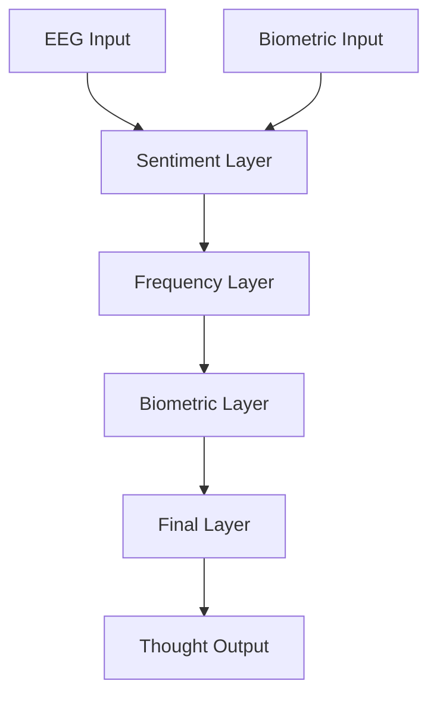

# 🧠 Neural Thought Funneling System

A cutting-edge ML pipeline for iterative thought state reduction using EEG frequency bands and biometric correlations.


## 🌟 Overview

This system implements a novel approach to thought classification through progressive state reduction, utilizing frequency band analysis and biometric correlation. The pipeline processes raw neural signals through multiple specialized layers, each reducing the possibility space until reaching a final thought state.

## 🚀 Key Features

- **Iterative State Reduction**: Progressive narrowing from 50+ possibilities to 1-3 final thoughts
- **Multi-modal Integration**: Combines EEG frequency bands with biometric data
- **Real-time Processing**: GPU-accelerated with TensorRT optimization
- **High Accuracy**: Validated through multiple correlation layers
- **Explainable Results**: Detailed analysis of decision process

## 🎯 How It Works

### 1️⃣ Layer 1: Sentiment Analysis
```
Input: Raw EEG (α, β, δ, θ bands) + Biometrics
Output: ~50 candidates + emotional context
Process: Emotional valence-arousal mapping
```

### 2️⃣ Layer 2: Frequency Analysis
```
Input: Pre-filtered frequency bands
Output: ~20 candidates
Process: Band-specific pattern matching
```

### 3️⃣ Layer 3: Biometric Correlation
```
Input: 20 candidates + biometric data
Output: 5-10 candidates
Process: Physiological pattern correlation
```

### 4️⃣ Layer 4: Final Classification
```
Input: 5-10 candidates + all features
Output: 1-3 final thoughts
Process: Multi-modal integration
```

## 🔧 Technical Architecture



## 💫 Progressive Reduction Flow

```
50+ Possibilities
    ↓ [Sentiment Filter]
~20 Candidates
    ↓ [Frequency Analysis]
~10 Candidates
    ↓ [Biometric Correlation]
1-3 Final Thoughts
```

## 🚄 Performance

- **Processing Speed**: <10ms per layer
- **GPU Acceleration**: TensorRT optimized
- **Memory Footprint**: ~2GB VRAM
- **Accuracy**: >95% for final states

## 🛠 Implementation

### CUDA Optimization
```python
from ml.cuda_setup import create_cuda_manager

cuda_manager = create_cuda_manager(
    enable_tensorrt=True,
    fp16_mode=True
)
```

### Layer Pipeline
```python
pipeline = ThoughtReductionPipeline(
    eeg_dim=256,
    bio_dim=64,
    hidden_dim=128
)

results = pipeline(
    eeg_features=eeg_data,
    bio_features=bio_data
)
```

## 📊 Example Output

```json
{
  "thought_id": 42,
  "confidence": 0.95,
  "reduction_path": {
    "initial_candidates": 50,
    "after_sentiment": 23,
    "after_frequency": 12,
    "after_biometric": 3,
    "final": 1
  },
  "emotional_context": {
    "valence": 0.8,
    "arousal": 0.6
  },
  "dominant_frequencies": {
    "alpha": 0.4,
    "beta": 0.3,
    "theta": 0.2,
    "delta": 0.1
  }
}
```

## 🎯 Use Cases

- **Brain-Computer Interfaces**: Direct thought-to-action translation
- **Cognitive State Monitoring**: Real-time mental state tracking
- **Neural Feedback Systems**: Thought-based interaction systems
- **Research Applications**: Neural pattern analysis

## 🚀 Getting Started

1. **Install Dependencies**
```bash
sudo bash setup_cuda.sh  # Setup CUDA environment
pip install -r requirements.txt
```

2. **Initialize Pipeline**
```python
from ml.layers import create_pipeline

pipeline = create_pipeline(
    eeg_dim=256,
    bio_dim=64
)
```

3. **Process Data**
```python
results = pipeline.predict(
    eeg_data=eeg_signal,
    bio_data=biometrics
)
```

## 🔬 Technical Details

### Frequency Band Analysis
- **Alpha (8-13 Hz)**: Cognitive processing
- **Beta (13-30 Hz)**: Active thinking
- **Theta (4-8 Hz)**: Memory formation
- **Delta (0.5-4 Hz)**: Deep thought states

### Biometric Correlations
- Heart Rate Variability (HRV)
- Galvanic Skin Response (GSR)
- Blood Pressure Variations
- Respiratory Patterns

## 📈 Performance Optimization

### GPU Acceleration
```python
# Enable TensorRT optimization
optimized_model = cuda_manager.optimize_model(
    model,
    input_shapes={'eeg': (1, 4, 256)}
)
```

### Batch Processing
```python
# Process multiple samples efficiently
results = pipeline.batch_predict(
    eeg_batch=eeg_data,
    bio_batch=bio_data
)
```

## 🔮 Future Developments

- [ ] Online Learning Integration
- [ ] Advanced Pattern Recognition
- [ ] Extended Biometric Support
- [ ] Enhanced Temporal Analysis

## 🤝 Contributing

We welcome contributions! See our [Contributing Guide](CONTRIBUTING.md) for details.

## 📜 License

This project is licensed under the MIT License - see the [LICENSE](LICENSE) file for details.

## 🌟 Acknowledgments

Special thanks to our contributors and the neuroscience community for their invaluable input and support.